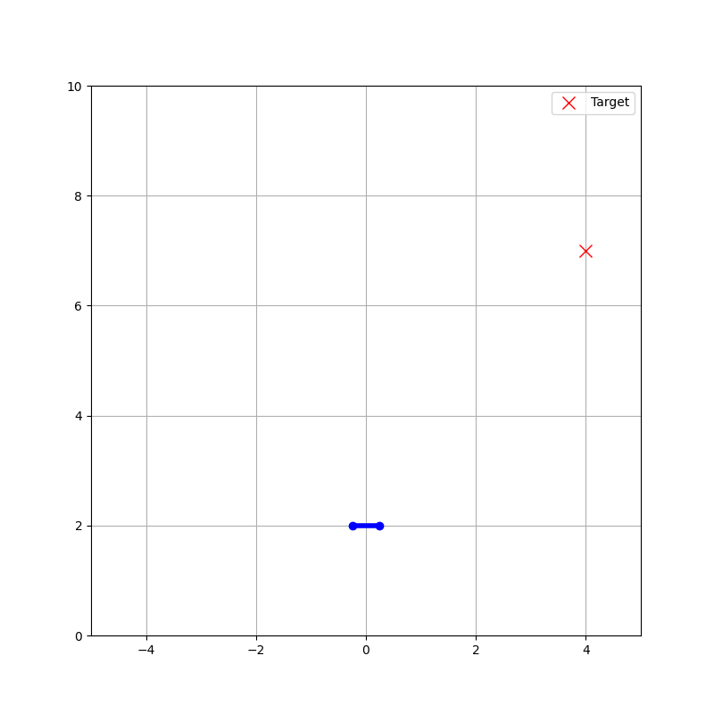

# Control Systems

## Simulator (`simulator.py`)
It's a simple 2D simulator of a quadcopter, represented with a line with dots at both ends. The simulator takes in the control inputs (thrust and torque) and updates the state of the quadcopter accordingly. The state includes position, velocity, angle, and angular velocity.

## Controllers (`controller.py`)
A class containing various control algorithms to stabilize the quadcopter. The main method is `compute_control`, which takes in the current state and desired state, and outputs the control inputs (thrust and torque) needed to achieve the desired state.

## Main Loop (`main.py`)
The main loop initializes the simulator and controller, and runs a simulation where the quadcopter tries to reach a desired position. It updates the state of the quadcopter at each time step and applies the control inputs computed by the controller.

## How to Run
1. Make sure you have Python installed on your system.
> It is recommended to use a virtual environment to manage dependencies. You can create one using `python -m venv env` and activate it with `source env/bin/activate` (Linux/Mac) or `.\env\Scripts\activate` (Windows).
2. Install the required dependencies: `python -m pip install -r requirements.txt`
3. Select the desired control algorithm in `main.py` in the `Simulator` class initialization. Currently available options: PD, LQR.
4. Set a target coordinate by changing the `target_x` and `target_y` variables in `drone.run_simulation()`.
5. Save and run the main script in the terminal: `python main.py`

## Plots
### PD

### LQR
